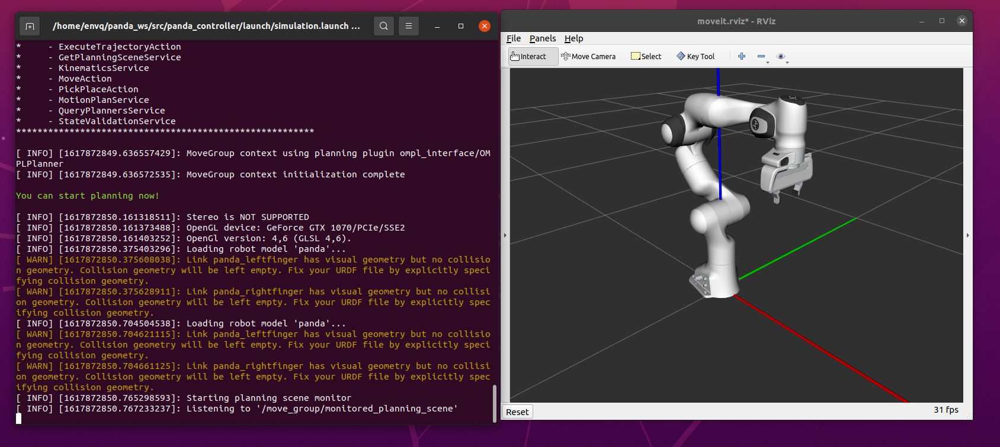
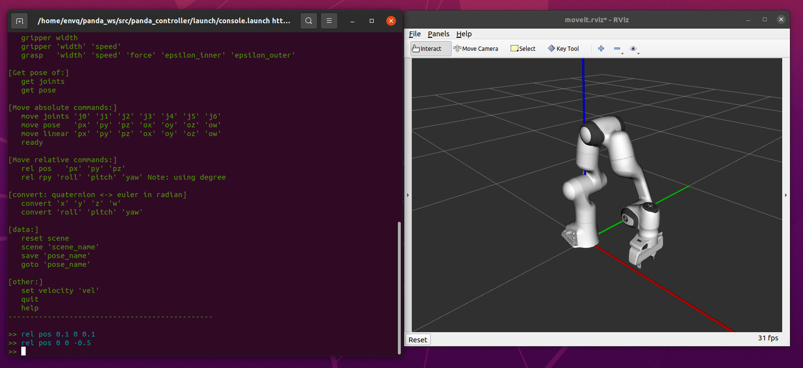
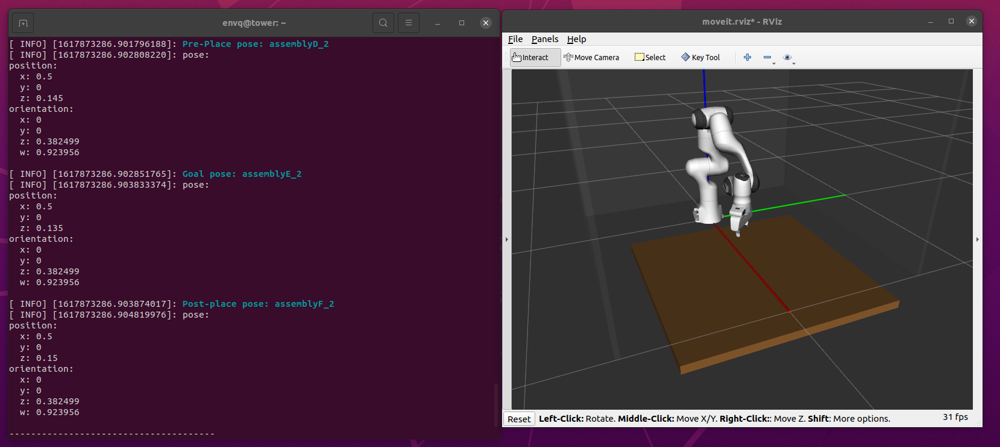
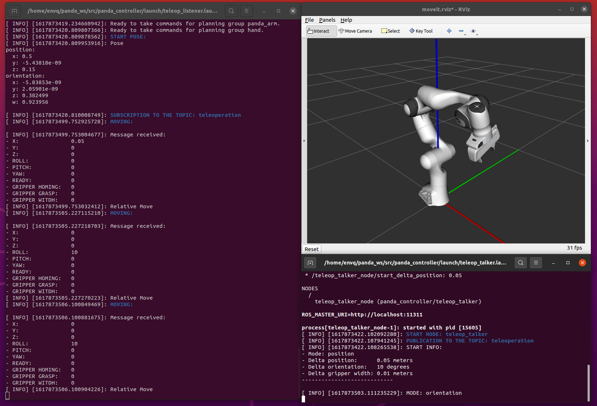

# **Panda Controller**
This is a set of utilities and examples for control Panda Franka Emika using Moveit.

## **Table of Contents**
* [Getting started](#getting-started)
    * [Dependencies and building](#Dependencies-and-building*)
* [Files](#files)
    * [data_manager](#data_manager)
    * [panda](#panda)
        * [panda_arm](#panda_arm)
        * [panda_gripper](#panda_gripper)
        * [panda](#panda)
    * [exceptions](#exceptions)
    * [colors](#colors)
    * [python](#python)
* [Data](#data)
* [Examples](#examples)
    * [console](#console)
    * [pick_and_place](#pick_and_place)
    * [teleoperation](#teleoperation)
        * [teleop_talker](#teleop_talker)
        * [teleop_listener](#teleop_listener)
* [Visual Studio Code](#vscode)
* [Author](#author)
* [License](#license)

---
## **Getting Started**
This package was tested with real robot with:
- Ubuntu 20.04 LTS Focal Fossa
- ROS noetic
- [libfranka](https://github.com/frankaemika/libfranka) 0.8.0
- [franka_ros](https://github.com/frankaemika/franka_ros) 0.7.1
- [panda_moveit_config](https://github.com/ros-planning/panda_moveit_config) 0.7.5

### **Dependencies and building**
Install [ROS](http://wiki.ros.org/melodic/Installation/Ubuntu)

Install [Catkin](http://wiki.ros.org/catkin)

Remove possible conflicts: 
~~~
sudo apt remove ros-noetic-*franka*
~~~

Install c++ tools:
~~~
sudo apt install clang-format cloc doxygen
~~~

**Prepare Workspace:**
~~~
cd

mkdir panda_ws

cd panda_ws/

mkdir lib src
~~~

**Get libfranka:**
~~~
cd ~/panda_ws/lib/

sudo apt install build-essential cmake git libpoco-dev libeigen3-dev

git clone --recursive https://github.com/frankaemika/libfranka

cd libfranka/

git checkout 0.8.0

git submodule update

mkdir build

cd build

cmake -DCMAKE_BUILD_TYPE=Release ..

cmake --build .
~~~

**Get franka_ros:**
~~~
cd ~/panda_ws/src/

git clone --recursive https://github.com/frankaemika/franka_ros

git checkout 0.7.1

cd ..

rosdep install --from-paths src --ignore-src --rosdistro noetic -y --skip-keys libfranka
~~~

**Get panda_moveit_config:**
~~~
cd ~/panda_ws/src/

sudo apt install ros-noetic-moveit

git clone https://github.com/ros-planning/panda_moveit_config.git -b melodic-devel
~~~

**Get panda_controller:**
~~~
cd ~/panda_ws/src/

pip3 install --user pyyaml

git clone https://github.com/Envq/panda_controller.git
~~~

**Building:**
~~~
cd ~/panda_ws/

catkin config -j$(nproc) --extend /opt/ros/${ROS_DISTRO} --cmake-args -DCMAKE_BUILD_TYPE=Release -DFranka_DIR:PATH=$HOME/panda_ws/lib/libfranka/build

catkin build

echo 'source ~/panda_ws/devel/setup.bash' >> ~/.bashrc

source ~/.bashrc
~~~

---
## **Files:**
Use this command for genere the doxygen documentation:
~~~
roscd panda_controller

doxygen doxygen.cfg
~~~

### **data_manager**
This file contains the functions necessary to save and read the data in the appropriate yaml files.

### **panda**
This file is a wrapper for easy use of moveit to control the Panda robot, designed for pick and place tasks. 

- #### **panda_arm**
    In this file are defined all the method for control the arm.

- #### **panda_gripper**
    In this file are defined all methods for controlling the gripper with client action for franka_gripper. If you set REAL_ROBOT=False Then you will be able to see in simulation (without having the robot connected) the movement of the gripper.

- #### **panda**
    This file contains panda_arm and panda_gripper providing getters to use them. It also adds the ability to create and reset scenes and pick and place. Note: the collision area of the robot hand is too large, so it is not possible to see in RVIZ the pick and place with the stl of the object.

### **exceptions**
A try catch system has been implemented to get more information about possible errors and exceptions are defined in this file.

### **colors**
This file contains the definitions to modify the colors and format of the stdout. Wrap your output string with them.

### **python**
The same files are also available for python3 with a console that can be launched using python_console.launch. Here a scripts utils is provided which contains the definition of functions for transformations.

---
## **Data**
This folder contains:
- **poses.json**:
    - **Description**: A collection of TCP (tool center point) poses, referring to the world frame
    - **Formant**: "name_pose" : {position : {x,y,z}, orientation : {x,y,z,w}}.
    - **Doc**: Look [here](http://docs.ros.org/melodic/api/geometry_msgs/html/msg/Pose.html) for more informations on **Pose**.
- **scenes.json**:
    - **Description**: A collection of Scene.
    - **Formant1**: "name_scene" : {name, color, position, orientation, type, dimensions}.
    - **Formant2**: "name_scene" : {name, color, position, orientation, type=mesh, file, scale}. 
        - Specify the format (.stl) in the "file" field.
        - Check the position of the origin on cad programs.
        - Use the scale field if the file is exported to a unit other than meters.
    - **Doc**:
        - Click [here](http://docs.ros.org/melodic/api/shape_msgs/html/msg/SolidPrimitive.html) for more informations on **SolidPrimite**.
        - Click [here](http://docs.ros.org/kinetic/api/std_msgs/html/msg/ColorRGBA.html) for more informations on **ColorRGBA**.
- **meshes/**: In this folder are contained the stl files

---
## **Examples**
These files have been created to easily set up pick and place tasks. There is the **template.cpp** file with the skeletron to create your custom task.

Note: all launch files containe the "real_robot" parameter which, if set to false, disables the gripper_action_client allowing to work without the real robot.

- Use **simulation.launch** file for launch simulation with real_robot=False.
- Use **controller.launch** file for control the real robot with real_robot=True.

### **console**
This node is a console for performing these simple tasks:
- **gripper homing**: homing the gripper
- **gripper width**: shows the gripper width. Remeber to use homing before to initiliaze.
- **gripper 'width' 'speed'**: moves the gripper with the specified speed on the specified width. Default speed value is setted in launch file.
- **grasp 'width' 'speed' 'force' 'epsilon_inner' 'epsilon_outer'**: performs the grasping. Default speed,force,epsilon values are setted in launch file.

- **get joints**: shows the joints values.
- **get pose**:  shows the TCP(tool center point) pose, referring to the world frame.

- **move joints 'j0' 'j1' 'j2' 'j3' 'j4' 'j5' 'j6'**: moves the arm joints in the specified configurations in Radian.
- **move pose   'px' 'py' 'pz' 'ox' 'oy' 'oz' 'ow'**: moves the TCP in the specified pose.
- **move linear 'px' 'py' 'pz' 'ox' 'oy' 'oz' 'ow'**: moves the TCP in the specified pose traveling in a straight line.
- **ready:** moves the arm in ready configuration.

- **rel pos 'px' 'py' 'pz'**: moves the arm TCP along the x,y,z directions in Meters.
- **rel rpy 'roll' 'pitch' 'yaw'**: rotates the arm TCP along the x,y,z axis in Degree.

- **convert 'x' 'y' 'z' 'w'**: converts the quaternion in RPY (Radian).
- **convert 'roll' 'pitch' 'yaw'**: converts the RPY (Radian) in quaternion.

- **reset scene:** resets scene.
- **scene 'name':** loads specified scene.
- **save 'name':** saves the current pose with the specified name. Default name is "last".
- **goto 'name':** moves the TCP in the saved pose named 'name'.

- **set velocity 'vel':** sets the arm max velocity scaling factor.
- **quit:** closes the node.
- **help:** shows the commands list.

Note: ',' are automatically ignored

### **pick_and_place**
This node execute the "pick and place" task. Two objects are moved in this example.

In the launch file you can modify the following parameters:

Parameters for startup:
- **real_robot**: if you want control the real robot set it to True to enable franka_gripper action client.
- **gripper_homing**: if you want to do the homing of the gripper on startup set it to True.

Parameters for gripper move:
- **gripper_speed**: sets the gripper speed.

Parameters for grasp:
- **grasp_speed**: sets the grasp speed.
- **grasp_force**: sets the grasp force.
- **grasp_epsilon_inner**: sets the grasp epsilon inner.
- **grasp_epsilon_outer**: sets the grasp epsilon outer.

Parameters for arm:
- **arm_velocity_factor**: sets the arm max velocity scaling factor.
- **eef_step**: sets the end-effector-step for linear motion.
- **jump_threshould**: sets the jump threshould for linear motion.

Parameters for pick and place:
- **object_width_I**: sets the grasp width for the I-th grasp
- **pre_grasp_name_I**: sets the name of the TCP pose saved for the I-th pre-grasp pose
- **grasp_name_I**: sets the name of the TCP pose saved for the I-th grasp pose
- **post_grasp_name_I**: sets the name of the TCP pose saved for the I-th post-grasp pose
- **pre_place_name_I**: sets the name of the TCP pose saved for the I-th pre-place pose
- **place_name_I**: sets the name of the TCP pose saved for the I-th place pose
- **post_place_name_I**: sets the name of the TCP pose saved for the I-th post-place pose
Add this parameters for each task you want.

### **teleoperation**
These nodes performs a simple teleoperation.

#### **teleop_talker**
This node read stdin for sending a message on the topic "panda_controller/teleoperation".

Use Mode to switch mode and INCREASE and DESCREASE KEYS to change the value of DELTA.

In the launch file you can modify the following parameters:
- **frequency**: sets the frequency of the read and send cycle.
- **start_delta_position**: sets the start delta in position value.
- **start_delta_orientation**: sets the start delta in orientation value.
- **start_delta_gripper**: sets the start delta in gripper value.
- **granularity_position**: sets the granularity for position.
- **granularity_orientation**: sets the granularity for orientation.
- **granularity_gripper**: sets the granularity for gripper width.
Then are available the parameters to modify the mapping of the commands.

#### **teleop_listener**
This node read from the topic "panda_controller/teleoperation" a message for moving the arm, and moves it.

In the launch file you can modify the following parameters:

Parameters for startup:
- **real_robot**: if you want control the real robot set it to True to enable franka_gripper action client.
- **gripper_homing**: if you want to do the homing of the gripper on startup set it to True.

Parameters for gripper move:
- **gripper_speed**: sets the gripper speed.

Parameters for grasp:
- **grasp_speed**: sets the grasp speed.
- **grasp_force**: sets the grasp force.
- **grasp_epsilon_inner**: sets the grasp epsilon inner.
- **grasp_epsilon_outer**: sets the grasp epsilon outer.

Parameters for arm:
- **arm_velocity_factor**: sets the arm max velocity scaling factor.
- **eef_step**: sets the end-effector-step for linear motion.
- **jump_threshould**: sets the jump threshould for linear motion.

---
## **VSCode**
I used these extensions:
- **c/c++** by microsoft
- **c++ intellisense** by austin
- **cmake** by twxs
- **doxygen** by christoph schlosser
- **clang-format** by xaver
- **doxgen documentation** by christoph schlosser
- **python** by microsoft
- **git graph** by mhutchie
- **gruvbox mirror** by adamsome
- **vscode-icons** by icons for visual studio code
- **git graph** by mhutchie

Are available the following tasks:
- **doxygen**: generates the documentation.
- **format**: formats all files.
- **cloc**: returns code statistics.

---
## **Author**
**Enrico Sgarbanti** [@**Envq**](https://github.com/Envq).

## **License**
This project is licensed under the GPL v3 License - see the [LICENSE.md](LICENSE.md) file for details.